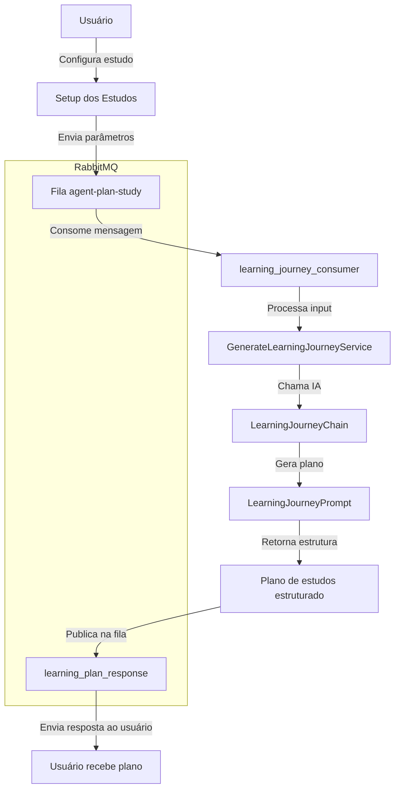
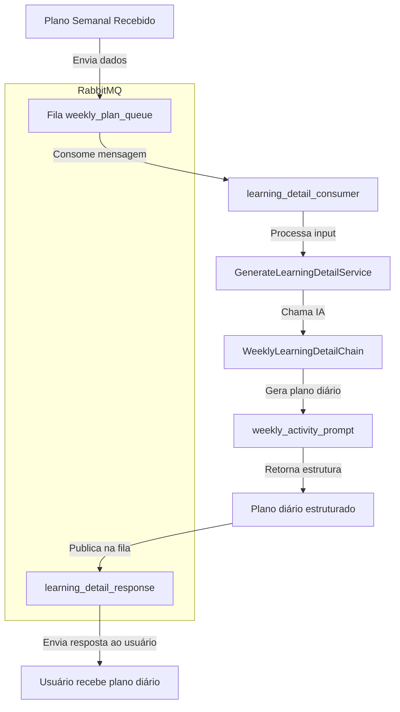
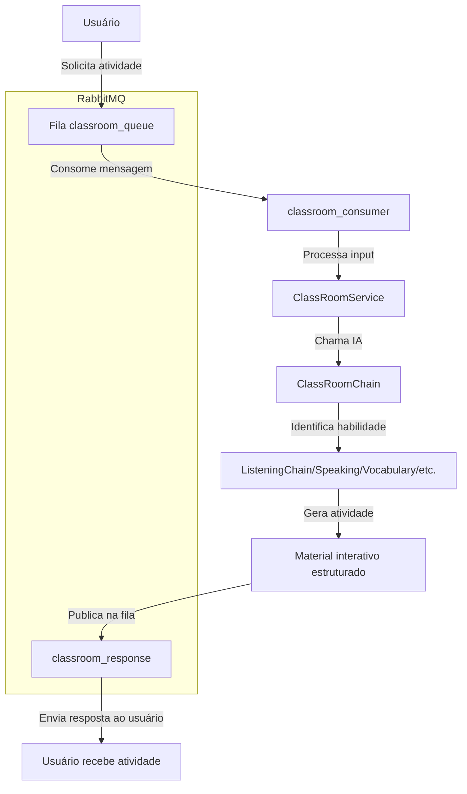
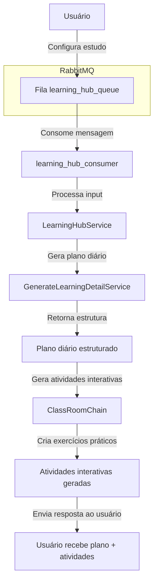

# Plano de Estudos

## Visão Geral
Este projeto gerencia a criação de planos de estudos personalizados para usuários com base em suas preferências de aprendizado. A estrutura utiliza **RabbitMQ** para comunicação assíncrona e **LangChain** para geração do plano de estudos via IA.

## Fluxo plano de Estudos macros
O fluxo de criação do plano de estudos segue os seguintes passos:

1. O usuário configura seus parâmetros de estudo (nível, duração, frequência semanal, horas diárias).
2. Esses dados são enviados para a fila `agent-plan-study` no RabbitMQ.
3. O consumidor `learning_journey_consumer` processa a mensagem e chama `GenerateLearningJourneyService`.
4. O serviço `GenerateLearningJourneyService` usa `LearningJourneyChain`, que:
   - Chama o modelo de IA `ChatOpenAI`.
   - Usa o `learning_journey_prompt` para estruturar um plano de estudos.
5. O plano gerado é estruturado em semanas e publicado na fila `learning_plan_response`.
6. O usuário recebe o plano de estudos pronto.

### Diagrama do fluxo



## Tecnologias Utilizadas
- **Python** (Asyncio, AioPika)
- **RabbitMQ** (Mensageria assíncrona)
- **LangChain** (IA para geração de planos de estudo)
- **OpenAI GPT-4o** (Modelo de linguagem)

## Como Executar
1. Instale as dependências com:
   ```sh
   pip install -r requirements.txt
   ```
2. Suba o RabbitMQ:
   ```sh
   docker-compose up -d
   ```
3. Execute o agente:
   ```sh
   python src/main.py
   ```

# Learning Detail - Plano Diário de Estudos

## Visão Geral
Este fluxo complementa o **Learning Journey**, detalhando um plano diário para cada semana de estudo. Ele estrutura atividades específicas para cada dia, garantindo um aprendizado progressivo e organizado.

## Fluxo do Learning Detail
O fluxo de criação do plano diário segue os seguintes passos:

1. O usuário recebe um plano macro gerado pelo **Learning Journey**.
2. Os dados da semana são enviados para a fila `weekly_plan_queue` no RabbitMQ.
3. O consumidor `learning_detail_consumer` processa a mensagem e chama `GenerateLearningDetailService`.
4. O serviço `GenerateLearningDetailService` usa `WeeklyLearningDetailChain`, que:
   - Chama o modelo de IA `ChatOpenAI`.
   - Usa o `weekly_activity_prompt` para estruturar um plano detalhado por dia.
5. O plano diário é publicado na fila `learning_detail_response`.
6. O usuário recebe um plano detalhado para cada dia da semana.

### Diagrama do fluxo




# Classroom - Atividades Interativas

## Visão Geral
Este fluxo permite a execução de **atividades interativas** dentro de um ambiente virtual de aprendizado, processando tarefas de **listening**, **speaking**, **pronúncia** e outras habilidades essenciais para o domínio do inglês.

## Fluxo do Classroom
O fluxo de criação das atividades interativas segue os seguintes passos:

1. O usuário solicita atividades interativas.
2. Os dados são enviados para a fila `classroom_queue` no RabbitMQ.
3. O consumidor `classroom_consumer` processa a mensagem e chama `ClassRoomService`.
4. O serviço `ClassRoomService` usa `ClassRoomChain`, que:
   - Chama o modelo de IA `ChatOpenAI`.
   - Identifica a habilidade a ser praticada e aciona a ferramenta correspondente.
   - Para atividades de **listening**, utiliza `ListeningChain`, que:
     - Faz buscas no YouTube para encontrar conteúdos relevantes.
     - Extrai transcrições usando `YoutubeLoaderTool`.
     - Gera exercícios personalizados baseados na transcrição.
5. As atividades interativas são estruturadas e publicadas na fila `classroom_response`.
6. O usuário recebe o material para praticar.

### Diagrama do fluxo



# Learning Hub - Integração do Plano Diário com Atividades Interativas

## Visão Geral

O **Learning Hub** unifica a geração do plano diário de estudos com atividades interativas, garantindo um aprendizado dinâmico e estruturado. Ele integra os fluxos do **Learning Detail** (plano detalhado) e **Classroom** (atividades interativas) em um único processo.

## Fluxo do Learning Hub

O fluxo segue os seguintes passos:

1. O usuário configura seu plano de estudos detalhado.
2. Os dados são enviados para a fila `learning_hub_queue` no RabbitMQ.
3. O consumidor `learning_hub_consumer` processa a mensagem e chama `LearningHubService`.
4. O serviço `LearningHubService` executa:
   - `GenerateLearningDetailService` para criar um plano diário estruturado.
   - Converte o plano diário em um formato utilizável para atividades interativas.
   - `ClassRoomChain` para gerar atividades práticas com base no plano diário.
5. As atividades e o plano são processados e entregues ao usuário.

### Diagrama do fluxo



## Tecnologias Utilizadas

- **Python** (Asyncio, AioPika, FastAPI)
- **RabbitMQ** (Mensageria assíncrona)
- **LangChain** (IA para geração de planos de estudo)
- **OpenAI GPT-4o** (Modelo de linguagem)
- **YouTube API** (Busca e extração de transcrições para atividades de listening)

##
